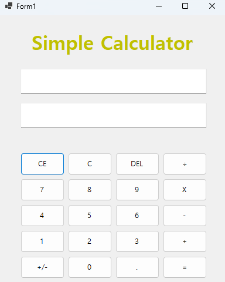
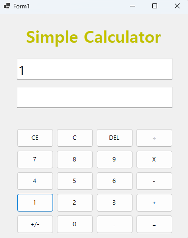
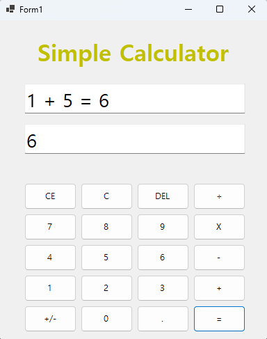
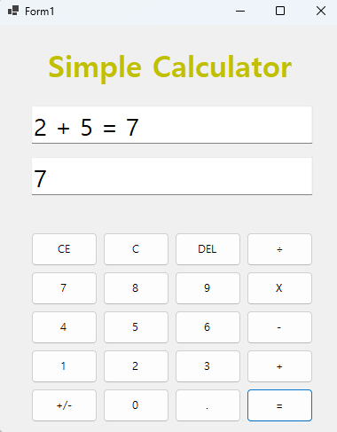
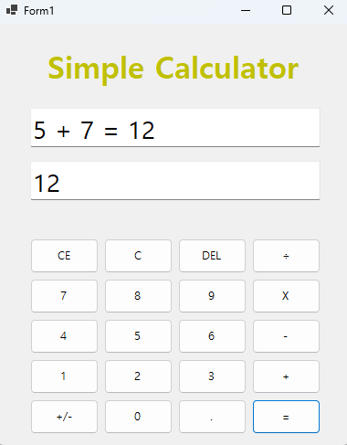

# (C# 코딩) Simple Calculator  

## 개요
- C# 프로그래밍 학습
- 1줄 소개: 사용자가 숫자와 연산자를 입력하면 실시간으로 계산 결과를 보여주고, 2진수/8진수/16진수 변환 기능까지 지원하는 프로그램  
- 사용한 플랫폼: C#, .NET Windows Forms, Visual Studio, GitHub  

- 사용한 컨트롤:
	- Label: 결과 및 안내 표시용  
	- TextBox (InputBox, OutputBox): 계산식 입력 및 결과 표시  
	- Button: 숫자 버튼(0~9), 연산자 버튼(+,-,×,÷), 기능 버튼(=, C, CE, DEL, ±, ., 2진수, 8진수, 16진수)  
	- ListBox: 선택적, 히스토리 표시 가능  

- 사용한 기술과 구현한 기능:
	- Visual Studio를 이용한 UI 디자인: 드래그 앤 드롭으로 컨트롤 배치  
	- 문자열 처리 (string 클래스): InputBox의 텍스트를 읽고 숫자와 연산자를 분리, 계산식 구성  
	- DateTime 클래스: (확장 가능) 현재 시간 정보를 계산 기록과 함께 표시 가능  
	- int.Parse / int.TryParse: InputBox 텍스트를 숫자로 변환  
	- Convert.ToString(value, base): 10진수 → 2진수/8진수/16진수 변환  
	- MessageBox: 오류 처리, 예외 안내  

1. 숫자 입력  
   - 숫자 버튼 클릭 시 InputBox에 누적 표시  
   - 예: 5 클릭 → "5", 이어서 3 클릭 → "53"  

2. 연산자 입력  
   - +, -, ×, ÷ 버튼 클릭 → InputBox에 연산자 표시  
   - 첫 숫자를 n1 변수에 저장  

3. 계산 기능 (= 버튼)  
   - InputBox의 두 번째 숫자를 n2 변수에 저장  
   - op 연산자에 따라 계산 수행  
   - 결과를 InputBox와 OutputBox 모두에 표시  
   - 나누기 시 0 처리  

4. 기능 버튼  
   - C 버튼: 전체 초기화 (InputBox, OutputBox, n1, n2, op)  
   - CE 버튼: 현재 입력 중인 숫자만 지우기 (5 × 100 → CE → 5 ×)  
   - DEL 버튼: InputBox 마지막 글자 삭제  
   - ± 버튼: InputBox 숫자 부호 반전  
   - . 버튼: 소수점 추가 (중복 방지)  

5. 진법 변환  
   - 2진수 버튼: OutputBox 숫자를 2진수로 변환  
   - 8진수 버튼: OutputBox 숫자를 8진수로 변환  
   - 16진수 버튼: OutputBox 숫자를 16진수로 변환, 대문자 표시  
   - InputBox와 OutputBox 모두 변환 결과 표시  

- 수업 중 배운 클래스 활용
	- string 클래스: 입력 데이터 처리, 공백 분리, 누적 표시  
	- int / Convert 클래스: 문자열 ↔ 숫자 변환, 진법 변환  
	- MessageBox 클래스: 입력 오류 및 0 나누기 처리  
	- Button / TextBox / Label / Form 클래스: Windows Forms UI 구현  

- 실습 중 구현한 기능 요약
	- 숫자와 연산자를 UI 버튼 클릭으로 입력받아 계산  
	- 계산 결과를 InputBox에 표시하면서 OutputBox에도 동시에 출력  
	- CE 기능으로 현재 입력 중인 숫자만 제거  
	- DEL 기능으로 마지막 글자 삭제  
	- ± 버튼으로 숫자 부호 변환  
	- . 버튼으로 소수점 입력 가능  
	- 2진수, 8진수, 16진수 변환 버튼으로 다양한 진법 확인

## 실행화면(과제1)
-과제1 코드의 실행 스크린샷

- 과제내용
1. 숫자버튼, 연산자 등 GUI 구현
2. 덧셈 기능 구현

- 구현 내용과 기능 설명
1. 숫자 버튼 클릭 → 입력값이 표시됨 (여러 개 클릭 가능)  
2. `+` 버튼 클릭 → 덧셈 연산 선택  
3. `=` 버튼 클릭 → 결과 표시  

- 데이터 처리
문자열 → 정수 변환: